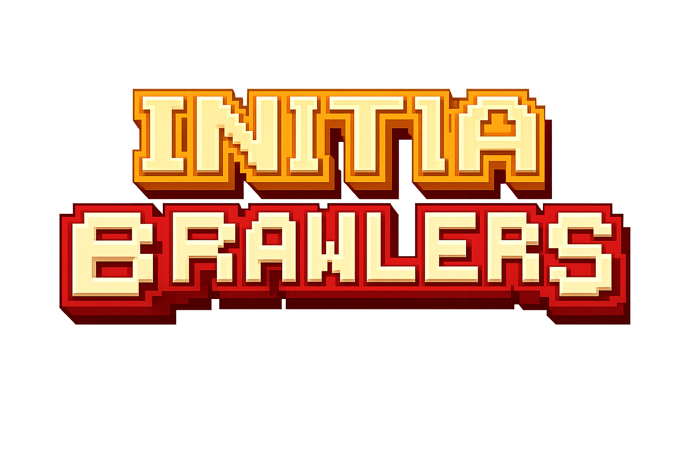
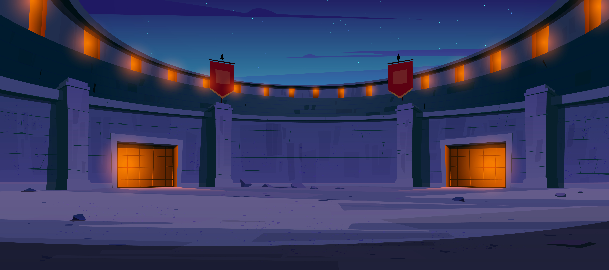
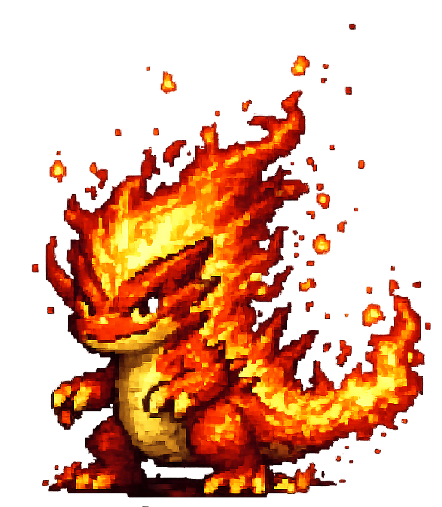
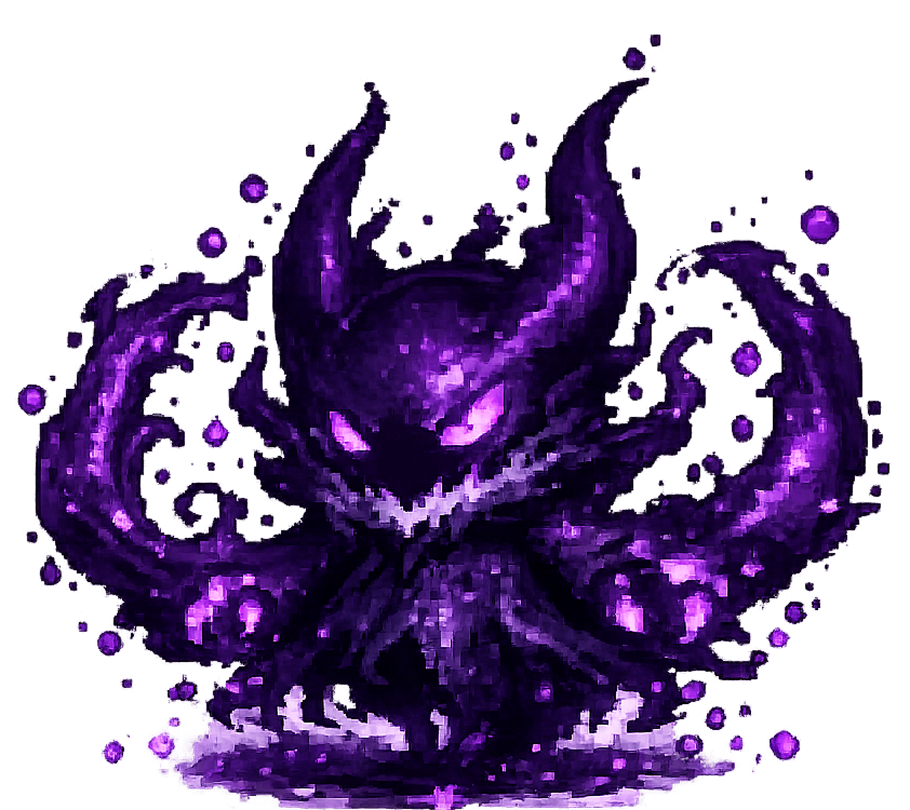

<p align="center">
  
</p>

<p align="center">
  <b>A High-Stakes, On-Chain Creature Battler built for the Initia Hackathon.</b><br>
  <i>Ship profitable apps in days with 100ms block times and seamless UX.</i>
</p>

<p align="center">
  
  
  
</p>

---

## ⚔️ Project Overview

**Initia Brawlers** is a fully on-chain, tactical creature battle game that leverages the power of the **Initia Stack** to deliver a high-performance web2-like gaming experience. Players mint unique elemental brawlers, train them against AI in the arena, and challenge rivals in wager-backed PvP duels.

By utilizing **Move VM** for game logic and **Independant Appchain Deployment**, we've built a scalable gaming economy where every move matters.

<p align="center">
  
</p>

---

## 🚀 Initia-Native Features

This project was built from the ground up to showcase the unique capabilities of the Initia ecosystem:

> [!IMPORTANT]
> ### ⚡ Auto-Signing (Session UX)
> Traditional blockchain games are plagued by constant wallet popups. Initia Brawlers implements **Session Keys**. Once you enter the battle arena, you approve a session once. Every subsequent "Attack", "Defend" or "Special" move is signed automatically in the background. **Zero popups. 100% immersive combat.**

> [!TIP]
> ### 🏷️ Initia Usernames (.init)
> We've integrated the Initia identity stack. Instead of searching for complex 0x addresses, players can find opponents using their human-readable `.init` names (e.g., `danii.init`). The game automatically resolves these names to addresses for on-chain challenges.

> [!NOTE]
> ### 🔗 Independent Appchain (Rollup)
> The entire game economy runs on its own dedicated Interwoven Rollup (`initia-brawlers-1`). This ensures 100ms block times and ensures that game traffic never competes with the mainnet, providing a dedicated performance layer for our players.

---

## 🎮 Game Features

### 1. The Elemental Stable
Collect and manage up to 6 brawlers. Each creature belongs to one of 5 elemental classes with a rock-paper-scissors advantage system:
- 🔥 **Pyra (Fire)**: High Attack, weak against Water.
- 💧 **Vyra (Water/Wind)**: High Speed and Versatility.
- 🌑 **Nox (Earth/Shadow)**: High Defense and Special Power.

<p align="center">
  
  
  
</p>

### 2. Strategic Combat
A deep, turn-based battle engine executed entirely on-chain:
- **Attack**: Standard damage based on `Attack` stat.
- **Heavy Attack**: High risk, high reward damage.
- **Defend**: Negate damage and potentially counter-attack on the next turn.
- **Special**: Use `Elemental Power` for devastating status-altering moves.

### 3. Wager-Backed PvP
Challenge other players to 1v1 duels. Both players escrow **INIT** tokens into the battle contract; the winner takes the entire prize pool (minus a small house fee for the DAO).

### 4. 8-Player Tournaments
Host or join weekly tournaments. 8 players compete in a single-elimination bracket for the ultimate title of **Arena Champion**.

---

## 🛠️ Technical Stack

- **L1/L2 Infrastructure**: [Initia Appchain](https://docs.initia.xyz) (Optimistic Rollup)
- **Smart Contracts**: Move VM (implemented in `brawlers`, `battle`, and `tournament` modules)
- **Frontend**: React 19, TypeScript, Vite, Tailwind CSS
- **Wallet Connection**: [@initia/interwovenkit-react](https://www.npmjs.com/package/@initia/interwovenkit-react)
- **Animations**: HTML5 Canvas with custom pixel-art engine

---

## 📦 Setting Up Locally

### Prerequisites
- Node.js v18+
- [Local Initia Node](https://docs.initia.xyz/run-a-node/local-testnet) (Optional, mock mode available)

### Installation
1. Clone the repository:
   ```bash
   git clone https://github.com/Danielodingz/Initia-brawlers.git
   cd Initia-brawlers
   ```
2. Install frontend dependencies:
   ```bash
   cd frontend
   npm install
   ```
3. Run the development server:
   ```bash
   npm run dev
   ```

### Running the Appchain
To run against a local appchain instead of mock mode:
1. Update `frontend/src/lib/constants.ts`: `MOCK_MODE = false`.
2. Follow the [Initia Hackathon Guide](https://docs.initia.xyz/hackathon/step-by-step-guide) to deploy the Move contracts using `minitiad`.

---

## 📄 Submission Metadata

- **Chain ID**: `initia-brawlers-1`
- **VM**: `Move VM`
- **Track**: `Gaming`
- **Repo URL**: [Danielodingz/Initia-brawlers](https://github.com/Danielodingz/Initia-brawlers)
- **Submission JSON**: `.initia/submission.json`

---

<p align="center">
  Built with ❤️ for the INITIATE Hackathon 2026.
</p>
